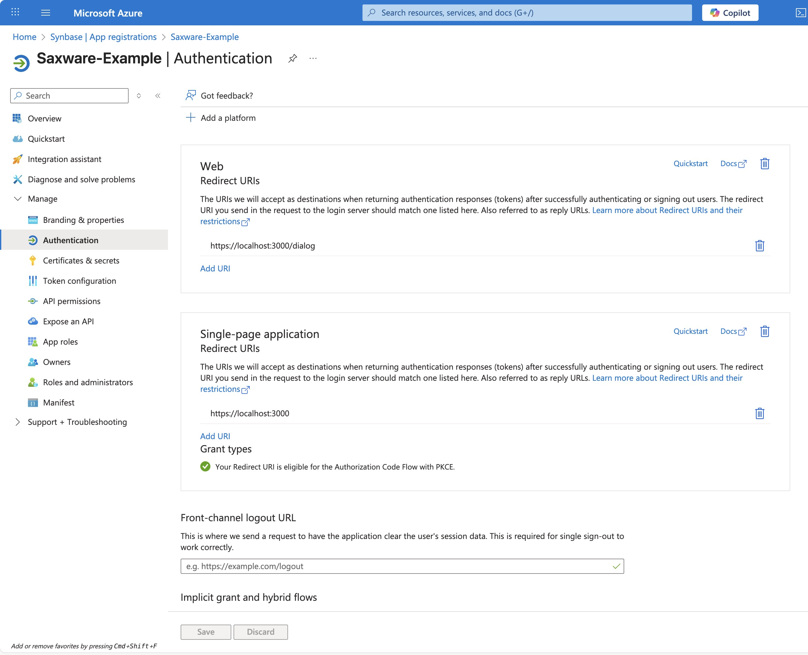
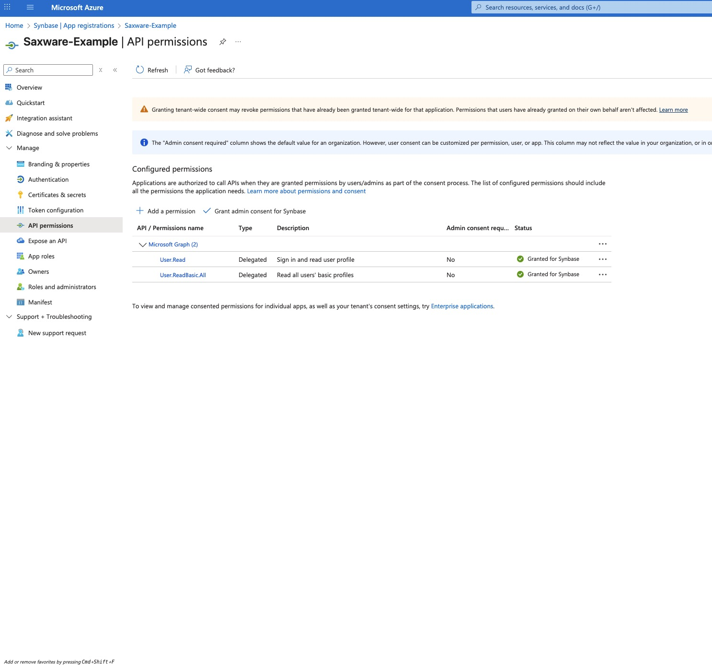
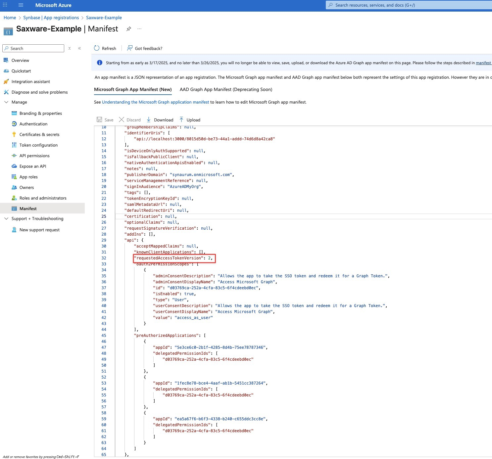

# Office Add-In Authentifizierungs-Flow

Dieses Projekt ist eine Beispiel-Implementierung für ein Office Add-In mit Single Sign-On (SSO) Authentifizierung. Das Add-In nutzt das Office SDK, um per SSO einen Token zu erhalten. Falls SSO nicht verfügbar ist, wird der Token über MSAL (Microsoft Authentication Library) bezogen.

## Was ist ein Office Add-In?

Ein Office Add-In ist eine Web-Anwendung, die innerhalb von Microsoft Office-Anwendungen (Word, Excel, PowerPoint, Outlook) läuft. Add-Ins erweitern die Funktionalität von Office und können auf Office-Daten zugreifen sowie Microsoft Graph API verwenden.

Weitere Informationen finden Sie in der [offiziellen Office Add-Ins Dokumentation](https://learn.microsoft.com/office/dev/add-ins/).

## Übersicht des Authentifizierungs-Flows

Dieses Beispiel implementiert einen zweistufigen Authentifizierungsprozess:

1. **Bootstrap Token Beschaffung**: 
   - **Primär**: Office SSO über `Office.auth.getAccessToken()` (nahtlos, ohne Benutzerinteraktion)
   - **Fallback**: MSAL-basierte Authentifizierung über einen Dialog (falls SSO nicht verfügbar)

2. **Token-Exchange**: 
   - Der Bootstrap Token wird serverseitig gegen Microsoft Graph Tokens eingetauscht (Access Token, Refresh Token, ID Token)
   - Verwendet den OAuth 2.0 On-Behalf-Of (OBO) Flow

3. **Session-Management**: 
   - Serverseitige Session wird erstellt und als Cookie gespeichert
   - Refresh Token wird sicher in der Datenbank gespeichert (nie an den Client gesendet)
   - Access Token wird automatisch erneuert, wenn es abläuft

## Detaillierter Authentifizierungs-Flow (File zu File)

### 3.1 Startpunkt: Taskpane

**Datei**: `src/pages/taskpane.astro`

Beim Laden der Taskpane wird die Authentifizierungs-Funktion aufgerufen:

```typescript
const session = await authenticate();
```

Die Taskpane ist die Hauptoberfläche des Add-Ins, die dem Benutzer angezeigt wird. Nach erfolgreicher Authentifizierung kann die Microsoft Graph API verwendet werden, um Benutzerdaten abzurufen.

**Nächster Schritt**: Die `authenticate()` Funktion wird aufgerufen.

---

### 3.2 Authentifizierungs-Logik

**Datei**: `src/auth/index.ts`

Die Hauptfunktion `authenticate()` koordiniert den gesamten Authentifizierungsprozess:

**Schritt 1: Prüfung bestehender Session**
```typescript
const sessionResponse = await fetch("/api/auth/session");
```
- Prüft, ob bereits eine gültige Session existiert
- Wenn ja: Session wird zurückgegeben, kein weiterer Authentifizierungsschritt nötig

**Schritt 2a: SSO Token holen** (Primär-Methode)
```typescript
bootstrapToken = await getSSOBootstrapToken();
```
- Versucht, einen Token über Office SSO zu erhalten
- Funktioniert nur, wenn SSO korrekt konfiguriert ist

**Schritt 2b: MSAL Fallback** (falls SSO fehlschlägt)
```typescript
bootstrapToken = await getMSALBootstrapToken();
```
- Wird automatisch aufgerufen, wenn SSO fehlschlägt
- Öffnet einen Authentifizierungs-Dialog

**Schritt 3: Login-Request an Server**
```typescript
const loginResponse = await fetch("/api/auth/login", {
    method: "POST",
    body: JSON.stringify({ bootstrapToken }),
});
```
- Sendet den Bootstrap Token an den Server
- Server tauscht Token gegen Graph Tokens

**Nächster Schritt**: Entweder SSO Token (`src/auth/sso/get-sso-bootstrap-token.ts`) oder MSAL Token (`src/auth/msal/get-msal-bootstrap-token.ts`)

---

### 3.3 SSO Token

**Datei**: `src/auth/sso/get-sso-bootstrap-token.ts`

Die einfachste Methode zur Token-Beschaffung:

```typescript
export async function getSSOBootstrapToken() {
    return await Office.auth.getAccessToken();
}
```

**Funktionsweise:**
- Nutzt das Office.js SDK, um direkt einen Access Token zu erhalten
- Keine Benutzerinteraktion erforderlich
- Funktioniert nur, wenn das Add-In korrekt im Azure Portal registriert ist

**Voraussetzungen:**
- `manifest.xml` muss `WebApplicationInfo` Sektion enthalten (siehe Abschnitt 4.2)
- Azure App Registration muss korrekt konfiguriert sein
- Add-In muss in Office geladen sein

**Weitere Informationen:**
- [Office Add-Ins SSO Dokumentation](https://learn.microsoft.com/office/dev/add-ins/develop/sso-in-office-add-ins)

**Nächster Schritt**: Falls erfolgreich → `src/pages/api/auth/login.ts`, falls fehlgeschlagen → MSAL Fallback

---

### 3.4 MSAL Fallback

**Datei**: `src/auth/msal/get-msal-bootstrap-token.ts`

Wenn SSO nicht verfügbar ist, wird MSAL verwendet:

**Funktionsweise:**
1. Prüft, ob bereits ein Account im MSAL-Cache vorhanden ist
2. Versucht, Token stillschweigend zu erhalten (`acquireTokenSilent`)
3. Falls nicht möglich: Öffnet einen Dialog für Benutzer-Authentifizierung

**Dialog-Handling:**
- **Dialog-Seite**: `src/pages/dialog.astro`
  - Lädt die MSAL-Dialog-Handler-Funktion
  - Wird in einem Office-Dialog-Fenster angezeigt

- **Dialog-Handler**: `src/auth/msal/handle-msal-dialog.ts`
  - Verarbeitet die MSAL-Authentifizierungsantwort
  - Sendet Token zurück an die Hauptanwendung über `Office.context.ui.messageParent()`

**MSAL Konfiguration**: Siehe `src/auth/auth.config.ts` (Abschnitt 4.3)

**Nächster Schritt**: `src/pages/api/auth/login.ts`

---

### 3.5 Server-seitiger Login

**Datei**: `src/pages/api/auth/login.ts`

Der Server-Endpunkt verarbeitet den Bootstrap Token:

**Schritt 1: Token-Exchange**
```typescript
const tokens = await exchangeBootstrapToken(bootstrapToken);
```
- Tauscht Bootstrap Token gegen Graph Tokens (siehe Abschnitt 3.6)

**Schritt 2: User-Erstellung**
```typescript
await ensureUserExists(claims.oid);
```
- Extrahiert Benutzer-ID aus dem ID Token
- Erstellt Benutzer in der Datenbank, falls nicht vorhanden

**Schritt 3: Session-Erstellung**
```typescript
const sessionToken = generateSessionToken();
const sessionId = encryptSessionToken(sessionToken);
const session = await createSession(sessionId, claims.oid, tokens);
```
- Generiert einen sicheren Session-Token
- Verschlüsselt den Token (SHA-256 Hash)
- Speichert Session in der Datenbank mit Access Token, Refresh Token und Ablaufzeiten

**Schritt 4: Cookie setzen**
```typescript
setSessionTokenCookie(context, sessionToken, new Date(session.expiresAt));
```
- Setzt ein HttpOnly Cookie mit dem Session-Token
- Cookie ist sicher konfiguriert (Secure in Production, SameSite: lax)

**Nächster Schritt**: `src/auth/session/exchange-bootstrap-token.ts`

---

### 3.6 Token-Exchange

**Datei**: `src/auth/session/exchange-bootstrap-token.ts`

Implementiert den OAuth 2.0 On-Behalf-Of (OBO) Flow:

**Funktionsweise:**
1. Sendet Bootstrap Token an Microsoft Token-Endpunkt
2. Verwendet Grant Type `urn:ietf:params:oauth:grant-type:jwt-bearer`
3. Erhält im Gegenzug:
   - **Access Token**: Für Microsoft Graph API Aufrufe
   - **Refresh Token**: Zum Erneuern des Access Tokens (90 Tage gültig)
   - **ID Token**: Enthält Benutzerinformationen (Claims)

**Konfiguration:**
- **Token-Endpunkt**: `https://login.microsoftonline.com/${TENANT_ID}/oauth2/v2.0/token`
- **Scopes**: Definiert in `src/auth/auth.config.ts` (Standard: `openid`, `profile`, `offline_access`, `User.Read`, `User.ReadBasic.All`)

**Weitere Informationen:**
- [Microsoft OAuth 2.0 On-Behalf-Of Flow](https://learn.microsoft.com/azure/active-directory/develop/v2-oauth2-on-behalf-of-flow)

**Nächster Schritt**: Session wird erstellt (`src/auth/session/handle-session.ts`)

---

### 3.7 Session-Management

**Datei**: `src/auth/session/handle-session.ts`

Verwaltet Sessions und Token-Refresh:

**Session-Validierung** (`validateSession()`):
- Prüft, ob Session in der Datenbank existiert
- Validiert, ob Session noch nicht abgelaufen ist
- Prüft, ob Access Token erneuert werden muss

**Token-Refresh**:
- Automatisch, wenn Access Token innerhalb von 10 Minuten abläuft
- Verwendet Refresh Token, um neue Tokens zu erhalten
- Aktualisiert Session in der Datenbank
- Verlängert Session-Lebensdauer auf 90 Tage

**Session-Erstellung** (`createSession()`):
- Speichert Access Token, Refresh Token und Ablaufzeiten
- Session-Lebensdauer: 90 Tage (entspricht Refresh Token Gültigkeit)

**Nächster Schritt**: Session-Endpunkt (`src/pages/api/auth/session.ts`)

---

### 3.8 Session-Endpunkt

**Datei**: `src/pages/api/auth/session.ts`

Prüft bestehende Sessions:

**Funktionsweise:**
1. Liest Session-Cookie aus Request
2. Verschlüsselt Cookie-Wert (SHA-256), um Session-ID zu erhalten
3. Validiert Session über `validateSession()`
4. Erneuert Token automatisch, falls nötig
5. Setzt Cookie erneut (mit aktualisierter Ablaufzeit)
6. Gibt Session zurück (ohne Refresh Token aus Sicherheitsgründen)

**Verwendung:**
- Wird bei jedem Seitenaufruf aufgerufen, um Session zu prüfen
- Ermöglicht persistente Anmeldung über mehrere Browser-Sessions

---

### 3.9 Graph API Client

**Datei**: `src/graph/get-client-graph.ts`

Verwendet den Access Token für Microsoft Graph API Aufrufe:

```typescript
export function getClientGraph(accessToken: string) {
    return graphfi().using(
        GraphBrowser({
            baseUrl: "https://graph.microsoft.com/v1.0",
        }),
        BearerToken(accessToken),
    );
}
```

**Beispiel-Verwendung** (aus `src/pages/taskpane.astro`):
```typescript
const graph = getClientGraph(session.accessToken);
const user = await graph.me();
```

**Weitere Informationen:**
- [Microsoft Graph API Dokumentation](https://learn.microsoft.com/graph/overview)
- [PnP/Graph Library](https://pnp.github.io/pnpjs/graph/docs/)

---

## Konfiguration

### 4.1 Azure Entra ID App Registration

Bevor Sie das Add-In verwenden können, müssen Sie eine App-Registrierung in Azure Entra ID erstellen:

**Erforderliche Werte:**
- `ENTRA_APP_ID`: Application (Client) ID
- `ENTRA_APP_SECRET`: Client Secret
- `TENANT_ID`: Directory (Tenant) ID

**Schritte:**
1. Öffnen Sie das [Azure Portal](https://portal.azure.com)
2. Navigieren Sie zu **Azure Active Directory** → **App registrations**
3. Erstellen Sie eine neue Registrierung
4. Notieren Sie die **Application (Client) ID** und **Directory (Tenant) ID**
5. Erstellen Sie ein **Client Secret** unter "Certificates & secrets"
6. Konfigurieren Sie **Redirect URIs**:
   - `https://<SITE_URL>/dialog.html` (Platform "Web", MSAL)
   - `https://<SITE_URL>` (Platform "SPA", SSO)
   - 
7. Konfigurieren Sie **API Permissions**:
   - Microsoft Graph: `User.Read`, `User.ReadBasic.All`
   - Ihre eigene API: `access_as_user` (für SSO)
   - 
8. Setzen Sie die `requestedAccessTokenVersion` auf `2`
   - 

**Weitere Informationen:**
- [Azure App Registration Dokumentation](https://learn.microsoft.com/azure/active-directory/develop/quickstart-register-app)

---

### 4.2 Manifest-Konfiguration

**Datei**: `manifest.xml`

Das Manifest definiert die Add-In Konfiguration für Office:

**WebApplicationInfo Sektion** (für SSO):
```xml
<WebApplicationInfo>
    <Id>8015d50d-be73-44a1-addd-74d6d8a42ca8</Id>
    <Resource>api://localhost:3000/8015d50d-be73-44a1-addd-74d6d8a42ca8</Resource>
    <Scopes>
        <Scope>openid</Scope>
        <Scope>profile</Scope>
    </Scopes>
</WebApplicationInfo>
```

**Wichtige Felder:**
- **`Id`**: Muss mit `ENTRA_APP_ID` übereinstimmen
- **`Resource`**: Muss exakt dem Format `api://<SITE_URL>/<ENTRA_APP_ID>` entsprechen. Der Prefix `localhost:3000/` wird nur in der Testumgebung benötigt.
- **`Scopes`**: Mindestens `openid` und `profile` erforderlich

**Weitere Informationen:**
- [Office Add-In Manifest Dokumentation](https://learn.microsoft.com/office/dev/add-ins/develop/add-in-manifests)

---

### 4.3 MSAL Konfiguration

**Datei**: `src/auth/auth.config.ts`

Konfiguriert MSAL und Token-Einstellungen:

**MSAL Config** (`msalConfig`):
- **`clientId`**: Entra App ID
- **`authority`**: Tenant-spezifische Authority URL
- **`redirectUri`**: Muss mit Azure Portal Redirect URI übereinstimmen
- **`cacheLocation`**: `sessionStorage` (da eigene Session-Cookies verwendet werden und MSAL nicht zusätzlich cachen muss)

**MSAL Login Request** (`msalLoginRequest`):
- **Scopes**: `api://<SITE_URL>/<ENTRA_APP_ID>/access_as_user`
- Wird für den MSAL Login-Dialog verwendet

**Token-Exchange Scopes** (`scopes`):
- `openid`, `profile`, `offline_access`, `User.Read`, `User.ReadBasic.All`
- Werden beim Token-Exchange angefordert

**Session-Konfiguration:**
- **`sessionLifetime`**: 90 Tage (entspricht Refresh Token Gültigkeit)
- **`accessTokenTreshold`**: 10 Minuten (Token wird erneuert, wenn weniger als 10 Minuten verbleiben)

---

### 4.4 Umgebungsvariablen (.env Datei)

Alle Umgebungsvariablen werden über eine `.env` Datei im Projekt-Root konfiguriert. Die Konfiguration erfolgt in `astro.config.mjs` mit Astro's integriertem Environment-System.

**Pflichtvariablen:**

- **`ASTRO_KEY`** (server, secret): Astro Session-Schlüssel für Cookie-Verschlüsselung
- **`DB_URL`** (server, secret): Datenbank-URL (z.B. Turso/libSQL URL oder lokale Datei)
- **`TENANT_ID`** (client, public): Microsoft Entra ID Tenant-ID (z.B. `12345678-1234-1234-1234-123456789abc`)
- **`ENTRA_APP_ID`** (client, public): Azure App Registration Client-ID (Application ID)
- **`ENTRA_APP_SECRET`** (server, secret): Azure App Registration Client Secret
- **`ENTRA_APP_API_RESOURCE`** (client, public): API Resource Identifier für SSO (Format: `api://<SITE_URL>/<ENTRA_APP_ID>`)

**Optionale Variablen:**

- **`SITE_URL`** (client, public): Die öffentliche URL der Anwendung (ohne `https://`). Standard: `localhost:<PORT>`
- **`DB_AUTH_TOKEN`** (server, secret, optional): Authentifizierungs-Token für Remote-Datenbank (z.B. Turso)
- **`DB_REPLICA_PATH`** (server, secret, optional): Pfad für lokale Datenbank-Replikation (z.B. `./local.db`)
- **`DB_REPLICA_SYNC_INTERVAL`** (server, secret, optional, number): Sync-Intervall in Millisekunden für lokale Replikation
- **`PORT`** (optional): Port für den Development-Server (Standard: 4321)

**Beispiel `.env` Datei:**

Siehe `.env.example` im Projekt-Root.

**Hinweise:**

- Die `.env` Datei sollte **niemals** in Git committed werden (bereits in `.gitignore`)
- Verwenden Sie die `.env.example` Datei als Vorlage für andere Entwickler
- Für Production: Setzen Sie Umgebungsvariablen über Ihr Hosting-Provider (z.B. Azure App Service, Vercel, etc.)
- `ENTRA_APP_API_RESOURCE` muss exakt dem Format `api://<SITE_URL>/<ENTRA_APP_ID>` entsprechen
- `ASTRO_KEY` sollte mindestens 32 Zeichen lang sein und zufällig generiert werden

---

### 4.5 Datenbank-Schema

**Schema-Definitionen**: `src/db/tables/*.table.ts`

**User Tabelle** (`src/db/tables/user.table.ts`):
- Speichert Benutzer-IDs (Microsoft Entra ID Object ID)
- Wird automatisch erstellt, wenn ein neuer Benutzer sich anmeldet

**Session Tabelle** (`src/db/tables/session.table.ts`):
- **`id`**: Verschlüsselter Session-Token (SHA-256 Hash)
- **`userId`**: Referenz auf User Tabelle
- **`expiresAt`**: Session-Ablaufzeit (90 Tage)
- **`accessToken`**: Microsoft Graph Access Token
- **`accessTokenExpiresAt`**: Access Token Ablaufzeit
- **`refreshToken`**: Microsoft Entra ID Refresh Token (wird nie an Client gesendet)

**Migrationen:**
- Verwenden Sie `npm run migrate` um Datenbank-Migrationen auszuführen
- Schema wird automatisch generiert aus den Table-Definitionen

---

## Sicherheitsaspekte

### Refresh Token Sicherheit
- Refresh Token wird **niemals** an den Client gesendet
- Wird nur serverseitig in der Datenbank gespeichert
- Wird nur für Token-Refresh verwendet

### Session-Token Verschlüsselung
- Session-Token wird mit SHA-256 gehasht, bevor es in der Datenbank gespeichert wird
- Original-Token wird nur im HttpOnly Cookie gespeichert

### Cookie-Sicherheit
- **HttpOnly**: Cookie kann nicht über JavaScript zugänglich gemacht werden
- **Secure**: Cookie wird nur über HTTPS gesendet (in Production)
- **SameSite: lax**: Schutz vor CSRF-Angriffen

### Token-Validierung
⚠️ **Wichtig**: Aktuell werden Bootstrap Tokens nicht validiert. Dies ist empfohlen für Production.

**Empfohlene Implementierung:**
- [Microsoft Token Validation Beispiel](https://github.com/OfficeDev/Office-Add-in-samples/blob/main/Samples/auth/Office-Add-in-NodeJS-SSO/Complete/server-helpers/obo-auth-helper.js)
- Validieren Sie Bootstrap Tokens vor dem Exchange, um sicherzustellen, dass sie von Microsoft stammen

---

## Fehlerbehandlung

### SSO Fehler → MSAL Fallback
- Wenn `Office.auth.getAccessToken()` fehlschlägt, wird automatisch MSAL verwendet
- Keine Benutzerinteraktion erforderlich für den Fallback

### Token-Exchange Fehler
- Fehler werden im Server-Log protokolliert
- Client erhält HTTP 400 mit Fehlermeldung
- Benutzer sollte Add-In neu laden

### Session-Ablauf
- Wenn Session abgelaufen ist, wird Cookie gelöscht
- Benutzer muss sich erneut authentifizieren
- Session-Endpunkt gibt HTTP 401 zurück

### Dialog-Fehler (MSAL)
- Verschiedene Fehlercodes werden behandelt (12002, 12003, 12006)
- Fehlermeldungen werden an den Benutzer weitergegeben
- Dialog wird automatisch geschlossen bei Fehlern

---

## Nützliche Links

- [Office Add-Ins Dokumentation](https://learn.microsoft.com/office/dev/add-ins/)
- [Office Add-Ins SSO](https://learn.microsoft.com/office/dev/add-ins/develop/sso-in-office-add-ins)
- [Microsoft Graph API Dokumentation](https://learn.microsoft.com/graph/overview)
- [MSAL.js Dokumentation](https://github.com/AzureAD/microsoft-authentication-library-for-js)
- [Azure Entra ID Dokumentation](https://learn.microsoft.com/azure/active-directory/)
- [OAuth 2.0 On-Behalf-Of Flow](https://learn.microsoft.com/azure/active-directory/develop/v2-oauth2-on-behalf-of-flow)
- [Astro Framework Dokumentation](https://docs.astro.build/)

---

## Technologie-Stack

- **Astro Framework**: Web-Framework für die Anwendung
- **Office.js SDK**: Office Add-In API
- **MSAL.js**: Microsoft Authentication Library für Browser
- **Microsoft Graph API**: Über @pnp/graph Library
- **Arctic**: OAuth2 Library für Token-Management
- **Drizzle ORM**: TypeScript ORM für Datenbankzugriffe
- **LibSQL/Turso**: SQLite-kompatible Datenbank
